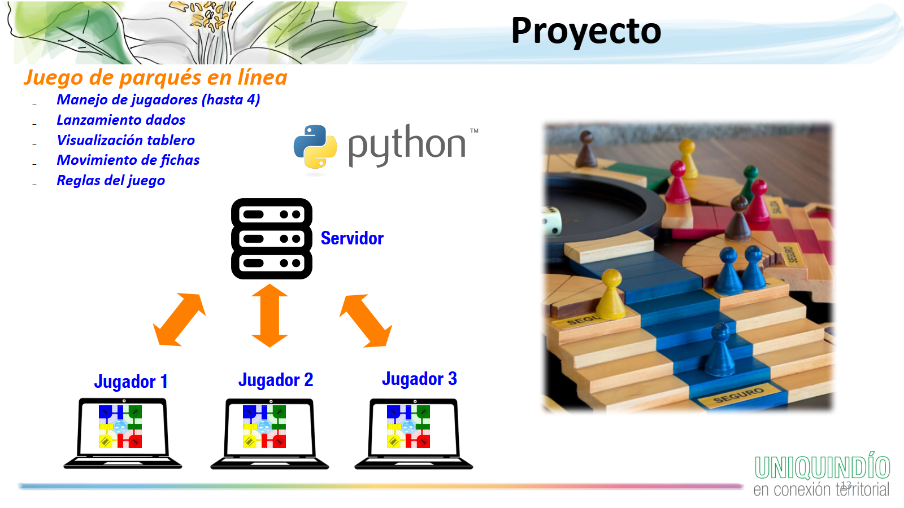

<h1 align="center">
Entrega: Servidor del Juego de Parqués (RA 1, RA 2, RA 3 y RA 4) <br />
 </h1>
 <p align="center">
Alexander López-Parrado, PhD. <br />
Programación, I-2026 <br />
GDSPROC <br />
Uniquindío <br />
</p>

Con el contenido de este repositorio se iniciará el desarrollo del código fuente en Python del proyecto del espacio académico. En este caso, y de acuerdo a la arquitectura mostrada en la siguiente figura, se construirá el código del lado del servidor que se requiere para implementar la lógica de un juego de parqués.

<p align="center">

</p>

En ese sentido, esta parte del proyecto contempla la implementación de las reglas de una partida de parqués para un máximo de 4 jugadores.

## Código base suministrado

Se suministra el código base del servidor en el archivo [websocket_server.py](sever_side/websocket_server.py) el cual contiene toda la funcionalidad para que éste opere dentro de una red de área local o en el mismo equipo de prueba, __este archivo no debe ser modificado bajo ninguna circustancia__. En ese sentido,  [websocket_server.py](sever_side/websocket_server.py) usa los archivos [server_adapter.py](sever_side/server_adapter.py) y [game_engine.py](sever_side/game_engine.py) que incluyen acciones y definiciones de funciones, respectivamente. Las acciones y sus correspondientes funciones deben ser codificadas o complementadas para implementar todas las reglas de una partida de parqués,  de acuerdo a lo descrito en los comentarios de los dos archivos. **La correcta integración de estas acciones y funciones, junto con su correcto funcionamiento determina la evaluación del lado del servidor del proyecto**.

El servidor debe llevar el control de la partida de parqués y la implementación de las reglas fundamentales. Para esto, en los archivos [server_adapter.py](sever_side/server_adapter.py) y [game_engine.py](sever_side/game_engine.py) se proponen un conjunto de acciones y funciones que pueden ser ajustadas o complementadas por parte del equipo de trabajo.


De otro lado, se suministran los archivos [client_transport.py](client_side/client_transport.py) y [test_client.py](client_side/test_client.py). En este caso,  [client_transport.py](client_side/client_transport.py) implementa la funcionalidad básica de los usuarios para la conexión con el servidor por lo que **no debe ser modificado bajo ninguna circunstancia**. De otro lado,  [test_project_client.py](test_project_client.py) es un archivo de prueba que se suministra para verificar el correcto funcionamiento del servidor y que puede ser modificado a gusto de los miembros del equipo. Para que [project_client.py](project_client.py) pueda funcionar correctamente se debe instalar el módulo de Python requests ejecutando el siguiente comando en una terminal:

``` pip install requests ```


## ¿Cómo realizar las pruebas?

Para la realización de las pruebas debe ejecutar primero el programa [project_server.py](project_server.py), la recomendación es verificar el correcto funcionamiento de las funciones, una a la vez. Posteriormente se puede ejecutar el programa [test_project_client.py](test_project_client.py), en caso de que se creen ventanas emergentes de Windows solicitando permisos, por favor otorgarlos ya que los programas hacen uso de los servicios de red. 

Tenga en cuenta que es posible que [project_server.py](project_server.py) y [test_project_client.py](test_project_client.py) se ejecuten en computadores diferentes siempre y cuando los equipos se encuentren conectados a la misma red LAN cableada o inalámbrica. En ese caso basta con consultar la dirección IP del computador que está ejecutando [project_server.py](project_server.py) mediante el comando ipconfig como se muestra en la siguiente figura.


<p align="center">

</p>

La IP encontrada debe sustituir "localhost" en la línea 8 de [test_project_client.py](https://github.com/parrado/entrega1-proyecto-2-2025/blob/04f719d46d3ce8efa7a7e977c52ec68f97b5276f/test_project_client.py#L8)

# Entregables

Para esta entrega no se requiere informe, únicamente la sustentación y el repositorio en GitHub cuyo enlace debe ser compartido en el enlace dispuesto para tal fin en la plataforma Google Classroom.
